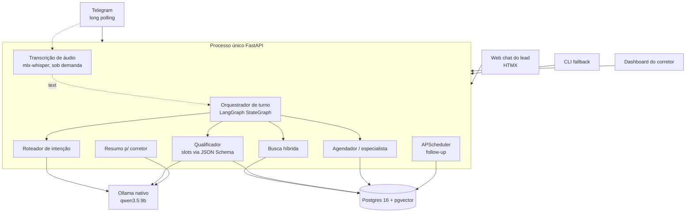
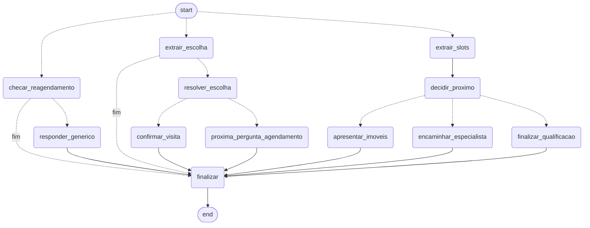

# Arquitetura

## Visão geral

Um processo FastAPI único hospeda tudo: os três canais de entrada (Telegram, chat web, CLI), o dashboard do corretor, o endpoint de CRM e o scheduler de follow-up. Todos os canais convergem no mesmo orquestrador — trocar de canal é escrever um adapter fino, não reescrever o agente.



**Frase central:** os cinco agentes são lógicos, não processos. Cada um é um prompt + um schema Pydantic, todos batendo no mesmo modelo Ollama já residente em memória — arquitetura multiagente com custo de inferência de um único modelo.

## Estrutura de pastas

```
app/
  agents/      router.py           decide o próximo passo do fluxo, 100% em código (sem LLM)
               qualifier.py        extrai slots (JSON Schema) da última mensagem
               search.py           busca híbrida SQL + pgvector
               scheduler_agent.py  extrai escolha de imóvel/horário, monta card e confirmação
               summarizer.py       gera o resumo pro corretor
  core/        graph.py            StateGraph do LangGraph — orquestração
               turno.py            lógica de negócio de cada nó (extração, resposta, resolução de data)
               llm.py              client do Ollama (chat_text, chat_structured), guardrails de saída
               prompts.py          persona e regras fixas
               memory.py           resumo rolante
               followup.py         agendamento e execução de follow-up
               scoring.py          score determinístico do lead
               security.py         mascaramento de PII
               traces.py           dataclass de observabilidade
               stt.py              transcrição de áudio local
               config.py           settings via .env (pydantic-settings)
  channels/    telegram.py         adapter Telegram (long polling + voice)
               cli.py              adapter CLI
  web/         api.py              FastAPI: dashboard, chat web, CRM, lifespan do bot Telegram
               templates/          Jinja2 + HTMX, zero build step
  db/          schema.sql  repo.py  seed.py
scripts/       buscar.py  baixar_modelo_stt.sh
```

Cada agente é uma função pura `(estado) -> schema`, testável sozinha, sem Telegram e sem banco — é a componentização que a rubrica de arquitetura cobra.

## Orquestração: LangGraph

`core/graph.py` expõe um `StateGraph` explícito. Cada nó chama uma função de `core/turno.py` — a lógica de negócio (extração de slots, resolução de datas, guardrails de imóvel) é reaproveitada sem alteração; o LangGraph decide **qual nó roda em qual ordem**, nunca **como** a chamada ao LLM é feita (isso continua em `core/llm.py`, com `httpx` puro — ver [IA.md](IA.md) sobre por que essa camada não usa LangChain).

Diagrama gerado direto do grafo compilado (`core/graph.py::exportar_mermaid()`):



**Entrada única, 3 ramos**, roteados pela aresta de entrada condicional em `lead["status"]`:

- **A — qualificação** (`novo`/`qualificando`): `extrair_slots` → `decidir_proximo` → um dos três nós terminais (`apresentar_imoveis`, `encaminhar_especialista`, `finalizar_qualificacao`).
- **B — escolha de visita** (`aguardando_escolha`): `extrair_escolha` → `resolver_escolha` (guardrail bairro-vs-nome) → `confirmar_visita` ou `proxima_pergunta_agendamento`.
- **C — pós-desfecho** (`visita_agendada`/`encaminhado`): `checar_reagendamento` → se não reagendou, `responder_generico`.

Todo caminho converge no nó comum `finalizar`, que roda três coisas depois de cada turno, independente do ramo: atualiza a memória rolante (`core/memory.py`), gera/atualiza o resumo pro corretor (`agents/summarizer.py`) se já houver intenção definida, e reagenda (ou cancela) o próximo follow-up conforme o status atual do lead (`core/followup.py`).

Sem checkpointer persistente do LangGraph: o Postgres já é a fonte de verdade de slots/mensagens/visitas, um checkpointer junto duplicaria estado.

## Fluxo de um turno

1. Canal (Telegram/web/CLI) recebe a mensagem, resolve/cria o lead por `chat_id` prefixado (`tg:`, `web:`, `cli:`).
2. Se for áudio: `core/stt.py` converte OGG/Opus → WAV, transcreve local (Whisper via MLX), o texto resultante segue o mesmo caminho de uma mensagem digitada — nenhum agente sabe que houve áudio.
3. `processar_turno` invoca o grafo compilado, que roteia pro ramo certo conforme o status do lead.
4. Dentro do ramo: uma chamada de **extração** (JSON Schema, `chat_structured`) atualiza o estado; uma chamada de **resposta** (texto livre, `chat_text`) gera a frase humanizada — nunca a mesma chamada faz as duas coisas.
5. Fatos críticos (preço, endereço, data, corretor) nunca são escritos pelo LLM — são montados em código a partir do banco e concatenados à frase gerada (ver [IA.md](IA.md), guardrails).
6. Nó `finalizar`: memória, resumo, follow-up.
7. Resposta volta pro canal; `mensagens` grava o turno inteiro (usuário e agente) com `origem` (`texto`/`audio`/`followup`).

## Modelo de dados

```sql
imoveis         200 registros — 10 cidades de SP; preço, quartos, cidade/zona/bairro,
                descrição, embedding(768), tsvector gerado
leads           chat_id único, canal, status, score, estado parcial do agendamento
slots           1:1 com lead — intenção, preço, quartos, região, urgência, perfil de investidor
mensagens       histórico completo, com origem (texto/audio/followup)
memoria         1:1 com lead — resumo rolante + contador de turnos já resumidos
visitas         desfecho do cenário compra/aluguel
encaminhamentos desfecho do cenário investimento
resumos         1:1 com lead — card pro corretor
agent_traces    1 linha por chamada de LLM — latência, tokens, tokens/s
follow_up_jobs  fila de reengajamento — pendente/enviado/cancelado
```

Índices: GIN em `imoveis.busca` (full-text), B-tree em `(finalidade, zona, preco, quartos)` para o filtro estruturado, e em `follow_up_jobs (executar_em) WHERE status='pendente'` pro scan do scheduler. **Sem índice vetorial** — com 200 linhas, scan sequencial é mais rápido que `ivfflat` (que ainda exigiria um `lists` compatível com a contagem de linhas); HNSW entra a partir de ~10 mil imóveis, sem mudar a query.

## Busca híbrida

Preço, quartos, bairro e finalidade são estruturados — filtrados com `WHERE` primeiro. O pgvector ranqueia só o descritivo livre ("varanda gourmet", "pé na areia"), combinado com busca full-text:

```
score_final = 0.6 * similaridade_vetorial + 0.4 * ts_rank
```

Mais barato e mais correto que RAG puro sobre texto não estruturado — o filtro determinístico elimina candidatos errados antes do ranking semântico entrar em cena.

## Observabilidade

Toda chamada ao LLM grava uma linha em `agent_traces`: agente, modelo, tokens de prompt/completion, latência e tokens/s — números reais, lidos direto da resposta do Ollama (`eval_count`, `eval_duration`), não estimados. O dashboard tem uma aba dedicada (`/dashboard/traces`) que faz polling a cada 3 s. É a base do argumento de escalabilidade: "o gargalo é medido, não estimado".

## Escalabilidade

1. **Aplicação stateless** — todo estado mora no Postgres. N réplicas do FastAPI atrás de um balanceador não exigem mudança de código.
2. **O LLM já está atrás de HTTP** — trocar `OLLAMA_HOST` por um cluster com GPU é variável de ambiente.
3. **O gargalo é medido** — `agent_traces` tem latência e tokens/s reais por chamada.
4. **O único componente single-node é o scheduler de follow-up** (APScheduler in-process). `follow_up_jobs` já é tabela — `SELECT ... FOR UPDATE SKIP LOCKED` vira fila distribuída sem trocar de tecnologia.
5. **Busca vetorial** — scan sequencial é a escolha certa em 200 imóveis; HNSW entra a partir de ~10 mil, sem mudar a query.

## Segurança

- PII (telefone) mascarada antes de persistir (`core/security.py::mascarar_telefone` — mantém DDD + 4 últimos dígitos).
- Prompt injection: mensagem do lead nunca concatenada no system prompt, sempre em turno `user` — o LLM não confunde instrução do sistema com texto do cliente.
- Token do bot nunca em log de texto puro — o logger do `httpx` (que loga a URL inteira da requisição, e o Telegram embute o token na URL: `/bot<TOKEN>/metodo`) é explicitamente suprimido pra `WARNING`.
- Rate limit por `chat_id`.
- Dado do lead nunca sai da máquina — modelo local, banco local. Efeito estrutural da arquitetura, não um add-on de compliance.

## Decisões de design e trade-offs

| Decisão | Alternativa considerada | Por quê |
|---|---|---|
| Um processo FastAPI para tudo (Telegram + dashboard + chat + CRM + scheduler) | Processos separados por canal | Menos partes móveis pra subir/derrubar numa demo; o diagrama da seção anterior sempre previu isso |
| LangGraph `StateGraph` explícito | `match`/`if` aninhado à mão | Componentização visível, diagrama gerado do grafo real (não desenhado à mão), sem reescrever a lógica de negócio já validada |
| `httpx` puro pro Ollama, não LangChain `with_structured_output` | Usar a abstração do LangChain também na chamada ao LLM | O `with_structured_output` do LangChain gera o schema pela rota padrão do Pydantic (`anyOf`), o mesmo formato que causava campo `null` silencioso no llama.cpp (ver IA.md) — trocar essa camada reabriria um risco já fechado |
| Fatos críticos (preço, data, corretor) montados em código, nunca escritos pelo LLM | Confiar em prompt + validação pós-geração | Testado: regra de prompt sozinha não segura um modelo de 9B (taxa de erro caiu, não zerou) — tirar o LLM do caminho do dado é garantia estrutural, não comportamental |
| Sem índice vetorial | `ivfflat` desde o início | Com 200 linhas o índice não ajuda e ainda exige `lists` calibrado; decisão documentada, não omissão |
| Follow-up via APScheduler in-process | Fila externa (Redis/Celery) desde o início | Menos um ponto de falha numa POC de 1 pessoa; a tabela `follow_up_jobs` já está desenhada pra virar fila distribuída depois, sem reescrever |
| STT com timeout duro em thread separada | Deixar `mlx_whisper.transcribe` rodar sem limite | Download do modelo via HF Hub travou indefinidamente em teste real (rede específica, ver IA.md) — sem timeout, um único áudio travaria o turno (e o processo do bot) pra sempre |

Mais detalhes de cada achado (com números de teste) em [PLANO.md](PLANO.md), que documenta a sessão inteira de desenvolvimento como um diário de bordo auditável.
